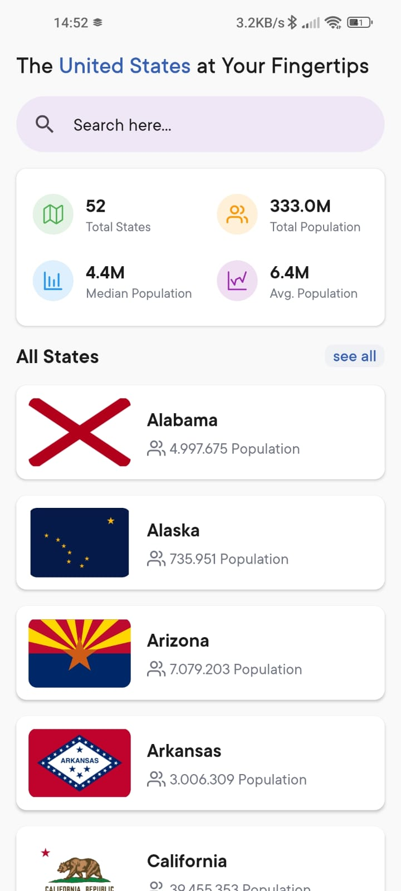

# United State Demography App

This React Native app is developed as part of the mobile programming course at [Binus University](https://binus.ac.id/). It provides insights into the population and geographical maps of the United States, along with a detailed list of its states.

The application showcases the use of React Native to deliver a cross-platform experience suitable for both Android and iOS platforms.

## Features
- View the overall population of the United States
- Interactive map showing different states
- A comprehensive list of states with individual details
- Search functionality to easily find information about each state

The application is designed with a focus on usability and performance, leveraging the React Native framework to ensure a seamless user experience.

Please refer to the screenshots above to get a glimpse of the app's functionality and design.

## Built With
- React Native - A framework for building native apps using React

<table>
  <tr>
    <td>
      <b>Home</b>
    </td>
    <td>
      <b>List</b>
    </td>
  </tr>
  <tr>
    <td align="center">
      
    </td>
    <td align="center">
      
    </td>
   </tr>
</table>
<table>
  <tr>
    <td>
      <b>Search</b>
    </td>
    <td>
      <b>Detail</b>
    </td>
  </tr>
  <tr>
    <td align="center">
      
    </td>
    <td align="center">
      
    </td>
   </tr>
</table>
